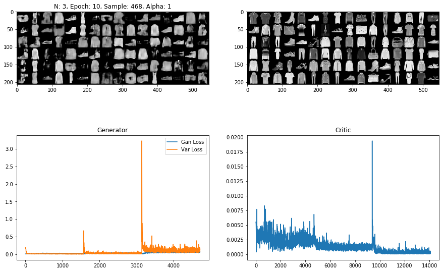
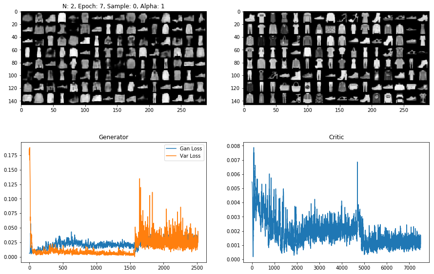

# Report

## Model Choice
The model is based on the 'growing GANs' paper. The generator
has for 'up-sampling' layers, which up-sample the input by factor
2 and the run a convolution over the result. These layers take in
the output of two affine layers that sample from a (point-wise)
normal prior. The up-sampling layers work on 16 channels and the final
result is converted to an image using a 1x1 convolution.

During training, the network is progressively grown by adding a new
layer every 10 epochs, fading it in over the course of half an epoch.
This is taken directly from the growing GANs paper.

The adversarial network is a mirror image of this architecture, which
adds 5 affine layers at the end and outputs a single probability.

The non-linear activations are all ReLUs, with the exception of the
output layers of each network.

## Model Exploration
During training, the model tends to be very unstable, collapsing on
a single mode. To avoid this, the variance of each output position over
the training batch is computed and the normal GAN loss has an added term
of the from:

    L_\text{var.} = \alpha \times \sum_{i,j,k} (var(g_\theta(z_\text{batch})) - var(\text{batch}) )^2,

where the power is computed point-wise.

This empirically reduced the mode collapse and forced the model to generate
samples with the correct variance.

## Final Model

Results for FashionMNIST:

## Performance

Seems okay (visual inspection, variance in results)

## Lessons Learned

- Don't start assignments on the day they are due
- Enforcing variance helps prevent mode-collapse
